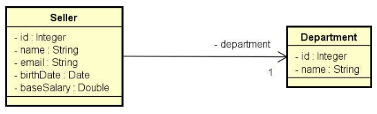

# Demo-dao-jdbc 

> Trata-se de um projeto java com banco de dados utilizando JDBC e padrão de projeto DAO (Data access object). 
O projeto é ralativamente pequeno e bem simples tendo uma classe **'Seller (vendedor)'** e outra de **'department (departamento)'** sendo que um vendedor depende de um departamento, conforme diagrama abaixo:



## Pré-requisitos

Antes de começar, verifique se você atendeu aos seguintes requisitos:
* Você precisa compreender a linguagem Java e conceitos de POO (Encapsulamento, herança e polimorfismo)
* Você precisa compreender interfaces
* Você precisa compreender o conceito de associação
* Você precisa compreender conceito de [**coesão**](https://www.devmedia.com.br/entendendo-coesao-e-acoplamento/18538)
* Você precisa compreender [**upcasting**](https://pt.stackoverflow.com/questions/131091/o-que-%C3%A9-upcasting-e-downcasting-na-linguagem-java)

### Features implementadas
- [x] Insert
- [x] Update
- [x] Delete
- [x] FIndById
- [x] FindByDepartment

### Divisão do projeto
O projeto foi dividido em duas aplicações ``Program 1`` onde contém todas as *chamadas* de features relacionadas a **Vendedor** e outra ``Program2`` onde contém todas as *chamadas* de features relacionadas a **departamento**

### Banco de dados utilizado
O banco utilizado nesse projeto foi o **Mysql** junto com a **API do JDBC** para fazer as [**features implementadas**](#features-implementadas) já citadas acima!


### Script SQL utilizada no banco
[Acessar](database.sql)
## Instalando o projeto <Demo-dao-jdbc>

Para instalar o projeto <demo-dao-jdbc >, siga estas etapas:

Linux, macOS e Windows:
```
<git clone git@github.com:AlissonWenceslau/demo-dao-jdbc.git>
```
### Próximo passo
 Após configurado todo o banco conforme [**script**](#sql-script) deixado acima e alterado o arquivo [**db.properties**](db.properties) com os dados do banco que você configurou, e só executar umas das classes ``Program``


[⬆ Voltar ao topo](#demo-dao-jdbc)<br>